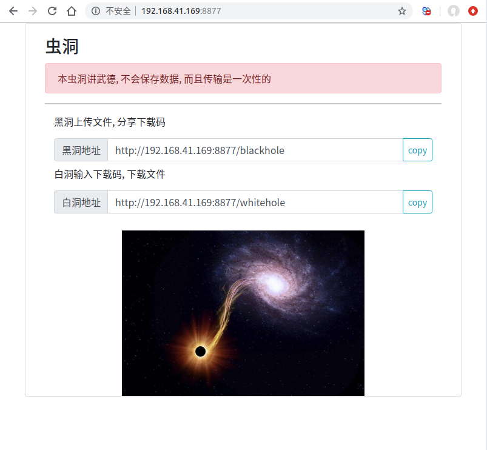
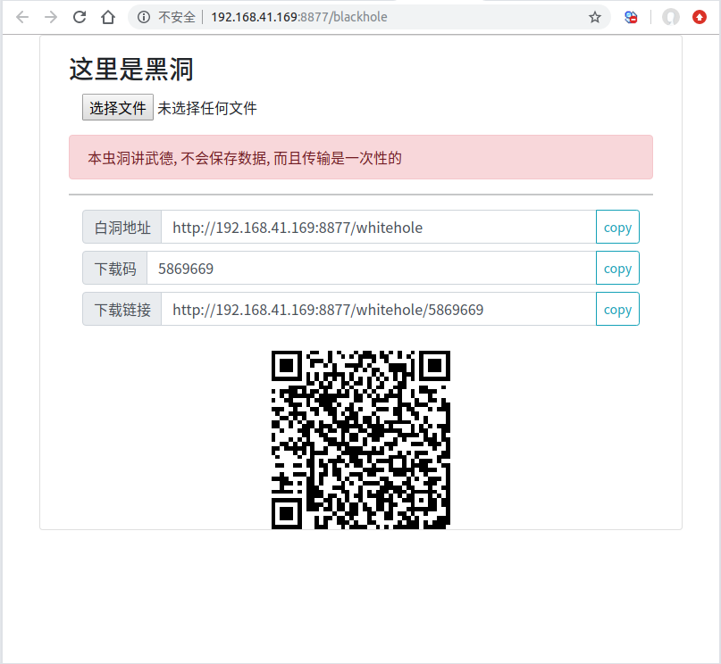
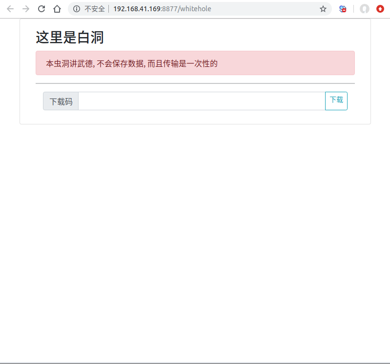

# 虫洞 wormhole
## 概述
本虫洞是匿名文件传输工具。

虫洞一头是黑洞,只进不出;另一头是白洞,只出不进;
正是文件传输的含义.

当我们在多个设备中传输文件时,常常借助IM软件,同时在多端登录,有时省事,有时麻烦.

## 部署

使用maven编译好之后,是一个独立的jar.通过下面命令可以启动. 其中server.port可以自己指定端口

    java -jar wormhole.jar --server.port=8877

## 用法

以localhost启动为例,

* 首页是`http://localhost:8877/`,展示了黑洞和白洞的地址信息.

* 黑洞是`http://localhost:8877/blackhole`,
1. 用于上传文件,同时将下载码或者下载连接发给接收方.
2. 也可以让接收方,扫码直接下载.

* 白洞是`http://localhost:8877/whiltehole`,
用于下载文件,来自于黑洞的下载码,点击下载.

## 注意

* 黑洞上传文件后会等待白洞下载文件,超过60秒无人接收,则超时处理;
* 白洞下载文件可以先于黑洞上传文件,这时一旦有人在黑洞上传文件,下载将立即开始;若超过60秒无人上传,则超时处理.
* 文件通过服务器中转,但服务器不会故意保存文件.
* 下载码是黑洞和白洞关联的id,如果泄漏,则文件会被其他人接收.
* 下载码可以自定义,输入一个特别长的字符串,可以起到安全的作用.
* 一次发送,只能有一次接收.